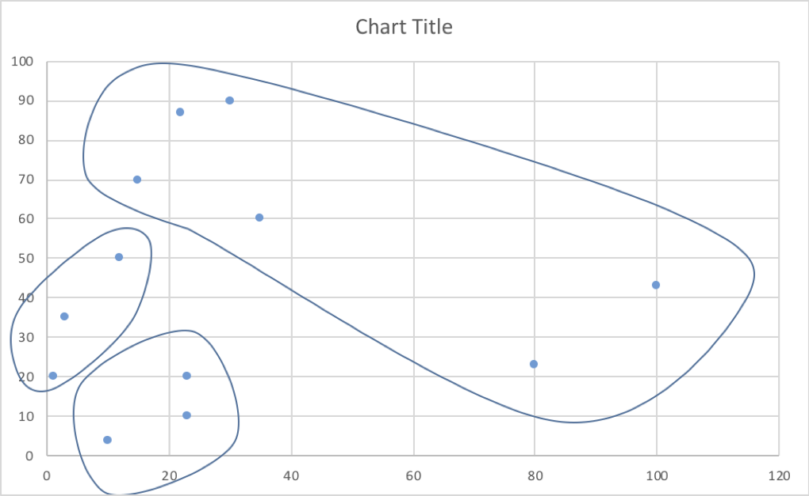

Numerical KMeans Clustering

 Expected Output:
 
<pre>
  0 1 2 2 0 1 1 1 1 1 1 1
  0 0 2 2 0 1 1 1 1 2 1 1
  0 0 2 2 0 1 1 1 1 2 1 1
 23 10 ==>  Cluster-0
 23 20 ==>  Cluster-0
 1 20 ==>  Cluster-2
 3 35 ==>  Cluster-2
 10 4 ==>  Cluster-0
 15 70 ==>  Cluster-1
 100 43 ==>  Cluster-1
 22 87 ==>  Cluster-1
 30 90 ==>  Cluster-1
 12 50 ==>  Cluster-2
 35 60 ==>  Cluster-1
 80 23 ==>  Cluster-1
</pre>

