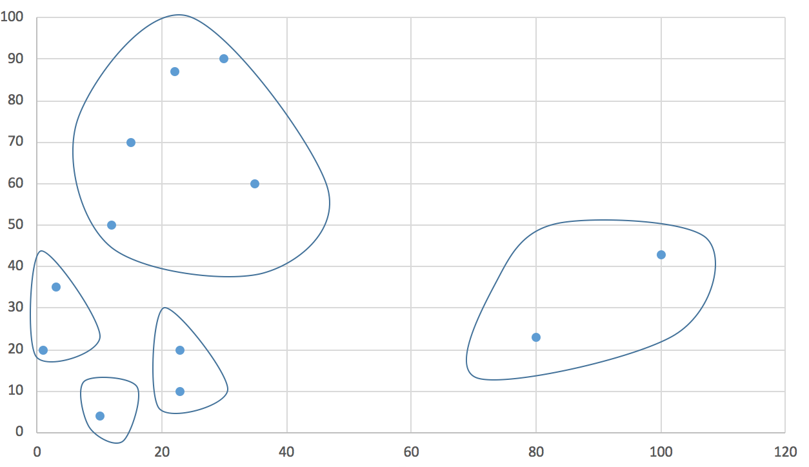

KMeans Clustering

 Expected Output:
 
<pre>
 23 10 ==>  Cluster-0
23 20 ==>  Cluster-0
1 20 ==>  Cluster-2
3 35 ==>  Cluster-2
10 4 ==>  Cluster-4
15 70 ==>  Cluster-3
100 43 ==>  Cluster-1
22 87 ==>  Cluster-3
30 90 ==>  Cluster-3
12 50 ==>  Cluster-3
35 60 ==>  Cluster-3
80 23 ==>  Cluster-1
</pre>

