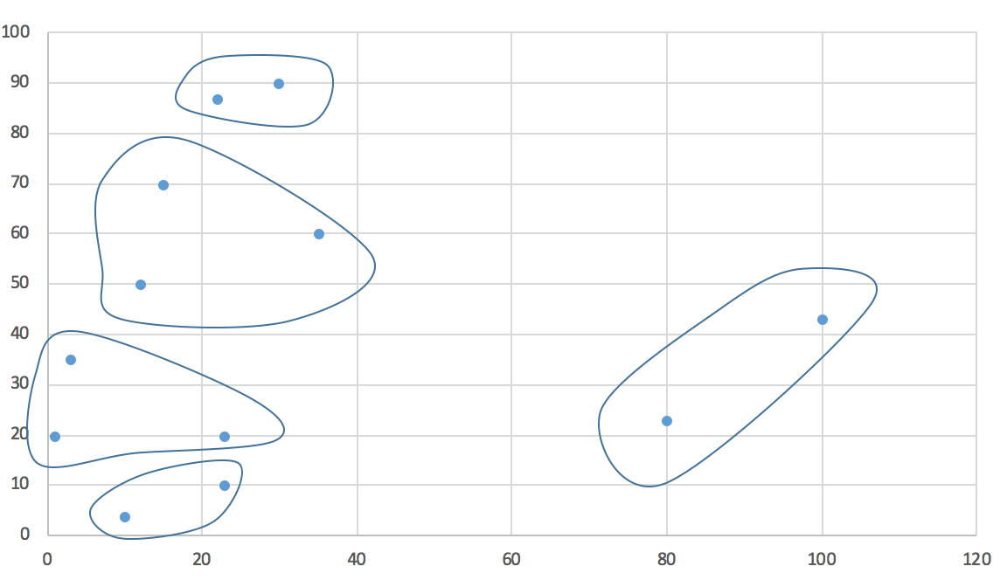

<pre>
Expected Output:
23 10 ==>  Cluster-0
23 20 ==>  Cluster-4
1 20 ==>  Cluster-4
3 35 ==>  Cluster-4
10 4 ==>  Cluster-0
15 70 ==>  Cluster-1
100 43 ==>  Cluster-2
22 87 ==>  Cluster-3
30 90 ==>  Cluster-3
12 50 ==>  Cluster-1
35 60 ==>  Cluster-1
80 23 ==>  Cluster-2
</pre>

